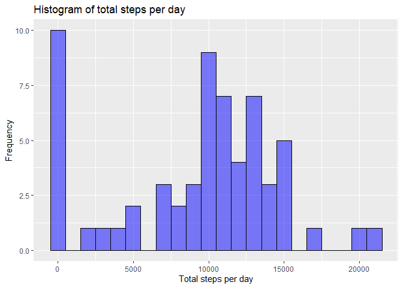
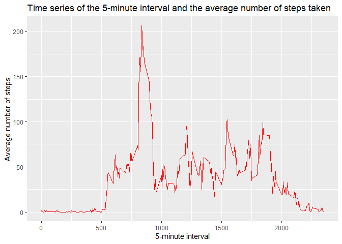
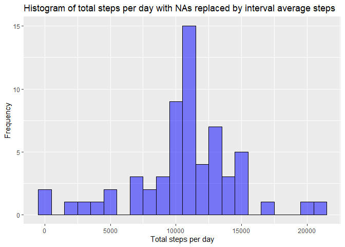
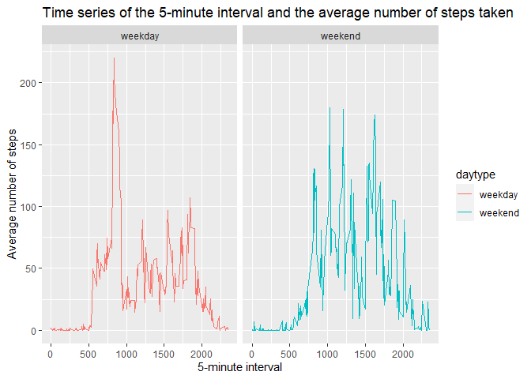

## Loading and preprocessing the data
Data have been loaded using read.csv() as follows:

```r
path<-'C:\\Users\\niloa\\Documents\\Data Science\\Curso5_reproductible research\\week2\\RepData_PeerAssessment1\\activity.csv'
data<-read.csv(path, header = T)
```

Then the needed packages have been loaded.

```r
library(lubridate)
library(dplyr)
library(ggplot2)
```

Finally, the date values had been converted from character to date class:

```r
data$date<-ymd(data$date)
```

## What is mean total number of steps taken per day?
First of all the data was grouped by day, and then the total steps for each day have been obtained.

```r
#grouping by day
dateGrouped<-group_by(data,date)
#total steps
totalSteps<-summarise(dateGrouped, total=sum(steps, na.rm = T))
```

The histogram of the total number of steps taken each day have been made using ggplot2 plotting system as follows:


```r
g<-ggplot(totalSteps, aes(total))
g+geom_histogram(fill = 'blue', binwidth = 1000, alpha=1/2, color='black')+labs(title = "Histogram of total steps per day",x='Total steps per day',y='Frequency')
```

<!-- -->

Finally, the mean and median of the total number of steps taken per day had been calculated.


```r
meanSteps<-mean(totalSteps$total)
medianSteps<-median(totalSteps$total)
```

The mean was 9354.2295082 steps and the median was 10395 steps.

## What is the average daily activity pattern?
In order to make the timeseries plot, the data have been grouped by interval, en then the average number of steps, for each interval, have been obtained.


```r
#grouping by interval
intervalGrouped<-group_by(data,interval)
#obtaining average number of steps for each interval
meanInterval<-summarise(intervalGrouped, mean=mean(steps, na.rm = T))
```

The timeseries plot have been made using ggplot2 as foloows:


```r
g<-ggplot(meanInterval, aes(interval, mean))
g+geom_line(color = 'red')+labs(title = "Time series of the 5-minute interval and the average number of steps taken",x='5-minute interval',y='Average number of steps')
```

<!-- -->

Maximum number of steps interval have been obtained using which.max() function:


```r
maxSteps<-round(meanInterval[which.max(meanInterval$mean),][,1])
```

and is the interval 835.

## Imputing missing values

First, the NAs in the steps row have been obtained and the total NAs have been computed.


```r
#rows and total rows with NAs
nas<-is.na(data$steps)
totalNas<-sum(nas)
```
2304 is the number of rows with NAs.

The NAs have been replaced by the average number of steps taken in the respective interval, averaged across all days.  

So first the average number of steps have been calculated using tapply():


```r
averageInterval<-tapply(data$steps,data$interval, mean, na.rm=T, simplify = T)
```

and then the new dataframe have been created and the NAs have been replaced by the average number of steps for the respective interval.


```r
#creating new dataframe
dataFull<-data
#replacing NAs
dataFull$steps[nas]<-averageInterval[as.character(dataFull$interval[nas])]
```

Finally, the histogram of the total number of steps taken each day and the mean and median total number of steps taken per day had been obtained.  

To do so, the data have been grouped by date and the average steps value for each date have been calculated.


```r
#grouping by date
dateGrouped<-group_by(dataFull,date)
#total steps
totalStepsFull<-summarise(dateGrouped, total=sum(steps, na.rm = T))
```

Histogram was made using ggplot2.


```r
g<-ggplot(totalStepsFull, aes(total))
g+geom_histogram(fill = 'blue', binwidth = 1000, alpha=1/2, color='black')+labs(title = "Histogram of total steps per day with NAs replaced by interval average steps",x='Total steps per day',y='Frequency')
```

<!-- -->

Mean and median of the steps taken by day have been obtained using mean() and median() functions:


```r
meanStepsFull<-mean(totalStepsFull$total)
medianStepsFull<-median(totalStepsFull$total)
```

Mean and median steps taken by day, using data with NAs replaced, had been of 1.0766189\times 10^{4} and 1.0766189\times 10^{4}. 

One can notice that these values differ from the estimates from the first part of the assignment. IN fact, the impact of imputing missing data on the estimates of the total daily number of steps is that the observed values got higher.

## Are there differences in activity patterns between weekdays and weekends?

To assess the activity patterns between weekdays and weekends a factor variable have been created, in which the date information have been splitted in weekdays and weekend days.  

The factor variable have been created using mutate() and weekdays() functions, and a new column "daytype" have been added to the dataframe.

```r
dataFull <- mutate(dataFull, daytype = ifelse(weekdays(dataFull$date, abbreviate = T) == "sab" | weekdays(dataFull$date, abbreviate = T) == "dom", "weekend", "weekday"))
dataFull$daytype <- as.factor(dataFull$daytype)
```

Then, the data have been grouped by interval and by daytype, and the average step number values have been obtained for each interval:


```r
#grouping by interval and then by daytype
daytypeGrouped<-group_by(dataFull,interval,daytype)
#obtaining average number of steps for each interval, by daytype
meanDaytype<-summarize(daytypeGrouped, mean=mean(steps))
```

Finally, a panel plot have been made using ggplot2.


```r
g<-ggplot(meanDaytype, aes(interval, mean))
g+geom_line(aes(color = daytype))+labs(title = "Time series of the 5-minute interval and the average number of steps taken",x='5-minute interval',y='Average number of steps')+facet_grid(.~daytype)
```

<!-- -->


